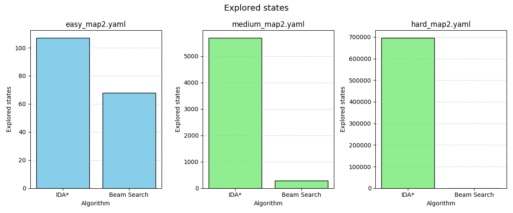
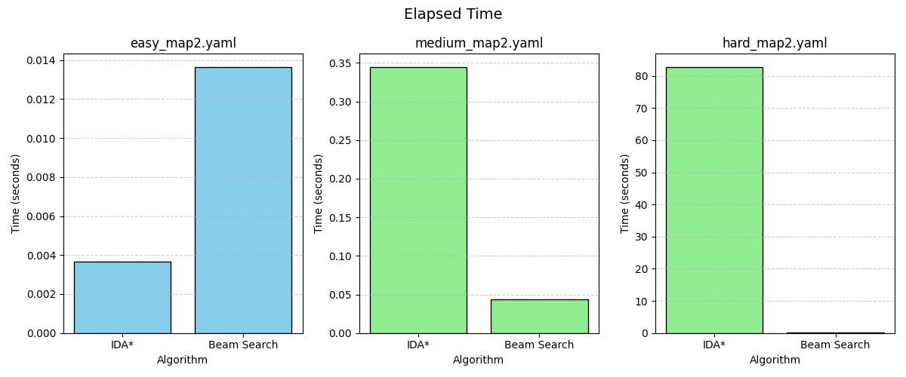

# Tema 1 – Sokoban  
**Inteligentă Artificială**  
**Nume student:** Jipa Darius-Andrei
**Grupa:** 331CD

---

## 1. Introducere
În această temă am implementat algoritmii **IDA\*** și **Beam Search** pentru rezolvarea automată a jocului Sokoban.  
Am explorat diverse euristici pentru a optimiza căutarea și am realizat o analiză comparativă cantitativă și calitativă a performanței acestora.

---

## 2. Euristici folosite

### 2.1 Heuristica 1: Manhattan simplu
- **Descriere**: suma distanțelor Manhattan de la fiecare cutie la cea mai apropiată țintă.
- **Motivație**: Este rapid de calculat și oferă o estimare decentă pentru progres.
- **Utilizare**: Niciun algoritm nu mai folosește această euristică, dar a servit ca punct de plecare.

### 2.2 Heuristica 2: Manhattan cu asociere Greedy a țintelor
- **Descriere**: optimizarea potrivirii cutii-scopuri folosind o abordare Greedy.
- **Motivație**: Găsește combinația globală optimă, evitând asocieri suboptimale.
- **Utilizare**: Beam Search folosește această euristică pentru că găsește suficient de rapid soluția chiar și pentru `super_hard_map1` și nu mai are nevoie de altă condiționare.

### 2.3 Heuristica 3: Asociere Greedy cu penalizare colțuri
- **Descriere**: adaugă penalizări mari pentru cutii blocate în colțuri ireversibile.
- **Motivație**: Fail-fast — detectează rapid stările imposibile.
- **Utilizare**: IDA\* folosește această euristică pentru că trece prin foarte multe stări și are nevoie de o euristică fail-fast pentru a mai economisi din timp.

---

## 3. Implementări și optimizări

### 3.1 Algoritmul IDA\*
- Am folosit un [**transposition table**](https://en.wikipedia.org/wiki/Transposition_table) bazat pe [**Zobrist hashing**](https://en.wikipedia.org/wiki/Zobrist_hashing) pentru a evita reexpandarea stărilor deja explorate. Hashing-ul este făcut la fiecare mutare pentru că este vorba de un simplu XOR care nu reprezintă mult.
- La fiecare iterație, pragul (`limit`) a fost ajustat în funcție de cele mai mici costuri peste limită.

### 3.2 Algoritmul Beam Search
- Am implementat un **Beam Search** clasic cu beam width fix (din teste am observat că 10 este o valoare acceptabilă).
- Pentru a evita ciclicitatea, am folosit **stocasticitate** în selecția mutărilor echivalente.

---

## 4. Grafice și analiză cantitativă

### 4.1 Număr de stări explorate

- **Observații**:
  - IDA\* explorează mai multe stări.
  - Inițial diferența nu se simte, dar la teste cum ar fi `hard_map2`, se poate observă o diferența uriașă.

---

### 4.2 Timp de rulare

- **Observații**:
  - Beam Search este de regulă mai rapid, cu excepția cazului inițial.
  - IDA\* are timpi stabili, dar crește exponențial la hărți mari.

---

## 5. Jurnalizare și ajustări făcute pe parcurs

### 5.1 Evoluția ideilor
- Inițial am folosit euristică Manhattan, dar am observat că oscila mult între stări aproape identice.
- Ulterior am încercat o asociere matematică a stărilor, dar avea un cost computațional prea mare.
- Am trecut la asocierea Greedy a cutiilor cu țintele pentru a evita blocajele. Asocierea Greedy reprezenta un balans potrivit între cost computațional și calitatea euristicii. 
- Pentru cazurile dificile (hard, super_hard_map) cu IDA\*, am penalizat colțurile pentru fail-fast deoarece IDA\* dura foarte mult (~30 de minute).

### 5.2 Probleme întâmpinate
- La început, Beam Search intră în cicluri infinite — am adăugat relaxare stocastică.
- În IDA\*, fără transposition table, memoria exploda — după implementarea hash-ului incremental problema a dispărut.

---

## 6. Concluzii

- IDA\* oferă soluții mai optime, dar costul în timp devine prohibitiv pe hărți mari.
- Beam Search găsește rapid soluții bune dar nu garantat optime.
- Asociere Greedy + penalizare colțuri a fost cea mai eficientă euristică în toate cazurile testate.
- Zobrist hashing a redus semnificativ timpul de explorare în IDA\*.

---

## 7. Referințe

- https://en.wikipedia.org/wiki/Transposition_table
- https://en.wikipedia.org/wiki/Zobrist_hashing
- http://sokobano.de/wiki/index.php?title=Main_Page
